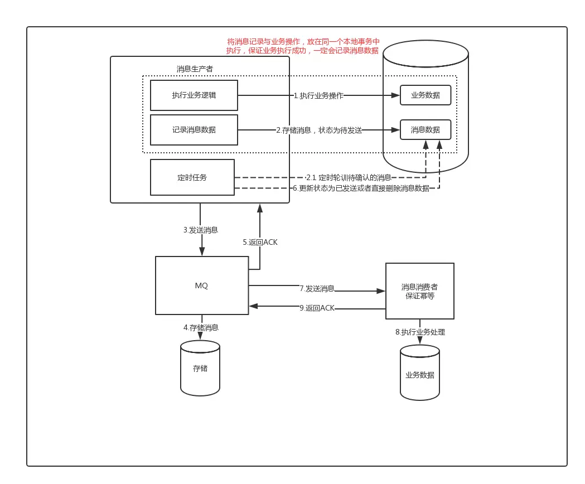
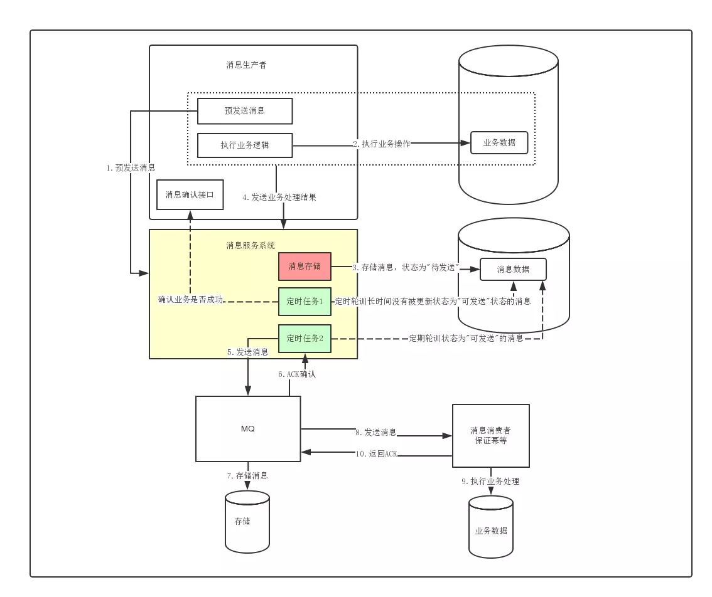

# 项目说明

##  项目启动
* 1.请将mysql  rabbitmq  zookeeper的 IP port 账号/密码 换成你自己的
* 数据库表在wiki中 message_center.sql order.sql pay.sql

## 基于本地消息的最终一致性

基于本地消息的最终一致性方案的最核心做法就是在执行业务操作的时候，记录一条消息数据到DB，
并且消息数据的记录与业务数据的记录必须在同一个事务内完成，这是该方案的前提核心保障。在记录完成后消息数据后，
后面我们就可以通过一个定时任务到DB中去轮训状态为待发送的消息，然后将消息投递给MQ。这个过程中可能存在消息投递失败的可能，
此时就依靠重试机制来保证，直到成功收到MQ的ACK确认之后，再将消息状态更新或者消息清除；而后面消息的消费失败的话，
则依赖MQ本身的重试来完成，其最后做到两边系统数据的最终一致性。基于本地消息服务的方案虽然可以做到消息的最终一致性，
但是它有一个比较严重的弊端，每个业务系统在使用该方案时，都需要在对应的业务库创建一张消息表来存储消息。
针对这个问题，我们可以将该功能单独提取出来，做成一个消息服务来统一处理，因而就衍生出了我们下面将要讨论的方案。

## 独立消息服务最终一致性

独立消息服务最终一致性与本地消息服务最终一致性最大的差异就在于将消息的存储单独地做成了一个RPC的服务，
这个过程其实就是模拟了事务消息的消息预发送过程，如果预发送消息失败，那么生产者业务就不会去执行，
因此对于生产者的业务而言，它是强依赖于该消息服务的。
不过好在独立消息服务支持水平扩容，因此只要部署多台，做成HA的集群模式，就能够保证其可靠性。
在消息服务中，还有一个单独地定时任务，它会定期轮训长时间处于待发送状态的消息，
通过一个check补偿机制来确认该消息对应的业务是否成功，如果对应的业务处理成功，则将消息修改为可发送，
然后将其投递给MQ；如果业务处理失败，则将对应的消息更新或者删除即可。因此在使用该方案时，
消息生产者必须同时实现一个check服务，来供消息服务做消息的确认。对于消息的消费，
该方案与上面的处理是一样，都是通过MQ自身的重发机制来保证消息被消费。
链接：https://www.jianshu.com/p/eb571e4065ec
